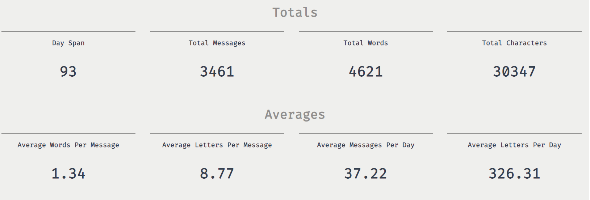
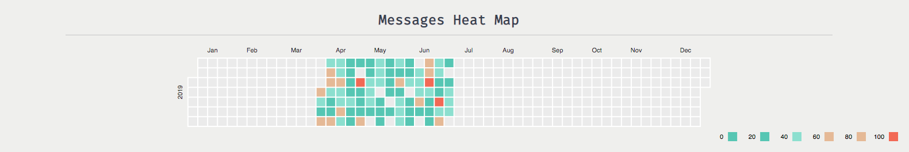
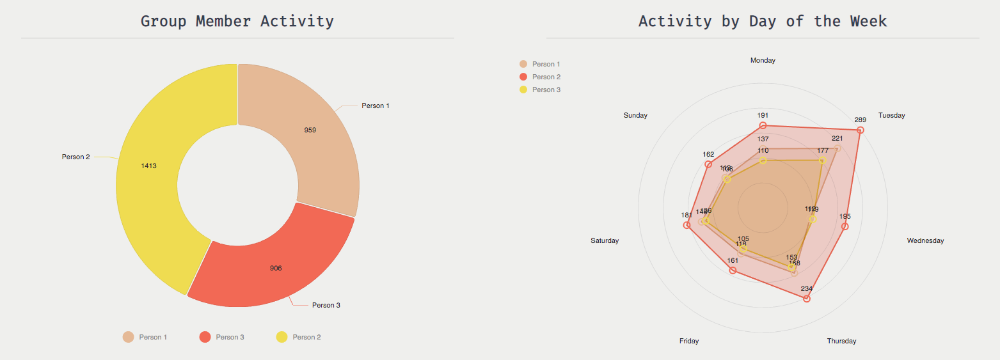
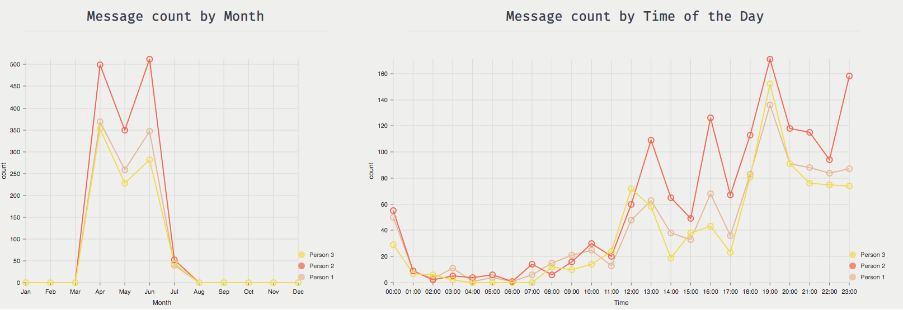

# Whatsapp Data Visualizer

You can view a live demo here: https://bright-process.surge.sh/#/

This web app lets you upload your whatsapp chat history and parses the information to display it in different graphs. 

This application is built entirely on the client side, so nothing is stored in a server/database, which means that **no data is collected** since everything is destroyed when you close your session.

Here are a few screenshots of the visualizations:

## Available Scripts

In the project directory, you can run:

### `yarn start`

Runs the app in the development mode. 
Open [http://localhost:3000](http://localhost:3000) to view it in the browser.

The page will reload if you make edits. 
You will also see any lint errors in the console.

### `yarn run build`

Builds the app for production to the `build` folder. 
It correctly bundles React in production mode and optimizes the build for the best performance.

The build is minified and the filenames include the hashes. 
Your app is ready to be deployed!

See the section about [deployment](https://facebook.github.io/create-react-app/docs/deployment) for more information.
